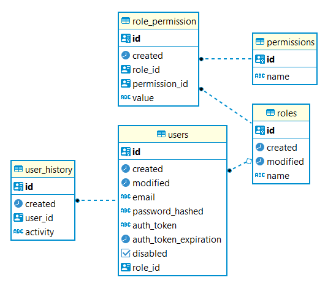
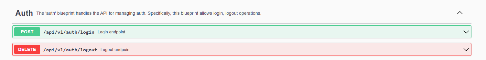
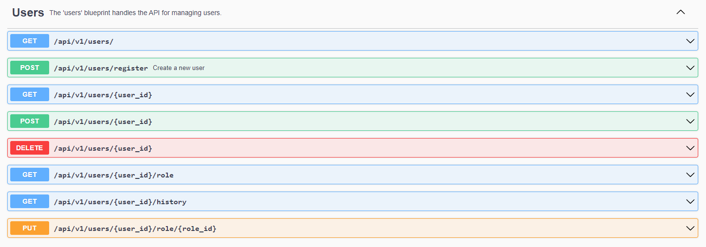
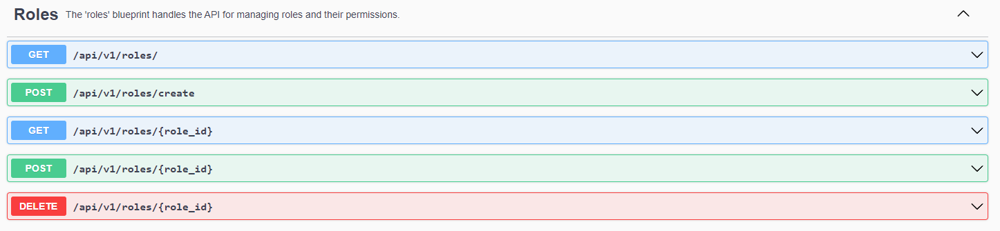

# Flask app

## Описание
Сервис аутентификации и авторизации пользователей онлайн-кинотеатра.

## Используемый стек
 
- flask
- [apifairy](https://apifairy.readthedocs.io/en/latest/intro.html)
- SQLAlchemy
- flask-alembic
- flask-marshmallow
- flask-jwt-extended
- redis (в качестве хранилища отозванных токенов пользователя)
- PostgreSQL

## Особенности

### Токены
При создании сессии пользователю выдается новый токен, для закрытых энпоинтов вход осуществляется по токену в хедерах запроса.
При выходе из аккаунта токен отзывается.
Redis используется для хранения отозванных токенов, при запросе в эндпоинт, требующий доступ, токен проверяется на валидность.
Работа с рефреш-токенами производится так, что они пересоздают истекающий access-token пользователя, если сессия активна.
Время жизни access и refresh-токенов настраивается через параметры окружения ACCESS_EXPIRES_IN_HOURS, REFRESH_EXPIRES_IN_DAYS.
Доступ без токенов доступен только для ручки регистрации нового пользователя.

### Ролевой доступ
Доступ к энднпоинтам осуществляется по указанным эндпоинту пермишенам, 
для этого из токена берется информация по пользователю и проверяется значение у данного пользователя указанных пермишенов.
Если true, то доступ к энднпоинту имеется, иначе ошибка. 
Пермишены являются неизменяемыми значениями.
По умолчанию создаются 3 роли - user, superuser, non_registered.
При создании суперпользователя ему назначается роль superuser.

### Схема базы данных

### Сваггер
**Auth**

**Users**

**Roles**

## Запуск приложения без докера

### Требования к окружению

- Запущенный PostgreSQL
- Запущенный Redis

### Запуск

`flask run` в консоли в папке src

### Создание миграции

`flask db migrate -m "name"` Создает новую миграцию с именем name

### Применение миграции
`flask db upgrade` Применяет миграцию к базе данных

### Создание дефолтных ролей и пермишенов

`flask roles create`

Нужно сделать после начальной миграции, до создания суперпользователя

### Создание суперпользователя

`flask superuser create` далее ввести email и пароль в интерактивном режиме

## Запуск приложения в докере

**Prod** - docker-compose.yml

**Dev** - docker-compose-dev.yml (с дополнительным контейнером тестов)

**Local** - docker-compose-local.yml (для запуска только БД и Redis)

## Тесты
Тесты запускаются как локально, так и в компоузе `docker-compose-dev.yml`. Отчет формитуется в формате html.

### Авторы
Артур Махмутов - https://github.com/hodosh

Илья Суворкин - https://github.com/ilyavfx

Шамиль Хайдаров - https://github.com/hsh01
